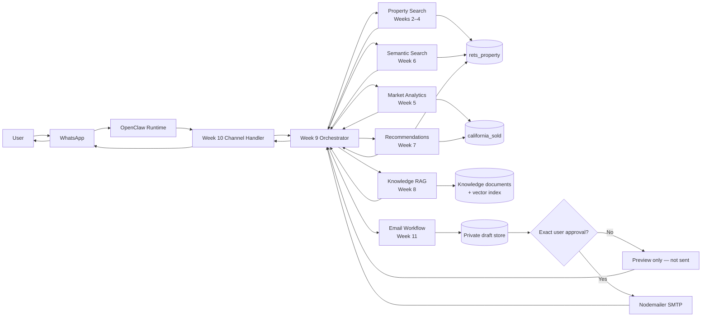

# IDX Multi-Agent Real Estate Assistant

OpenClaw-powered, production-oriented real-estate assistant built for the IDX Exchange AI Agentic Engineer Internship (Summer 2026). This single README consolidates the project documentation for Weeks 0–11.

The assistant accepts natural-language requests through WhatsApp, remembers follow-up preferences, searches active MLS listings, analyzes sold-market data, performs semantic search and comp-validated recommendations, answers document-grounded RAG questions, and prepares emails that can only be sent after explicit human approval.

## Table of Contents

- [Project at a Glance](#project-at-a-glance)
- [System Architecture](#system-architecture)
- [Data Sources](#data-sources)
- [Weekly Implementation](#weekly-implementation)
- [Setup](#setup)
- [Demo Commands](#demo-commands)
- [Suggested Final Demo Flow](#suggested-final-demo-flow)
- [Safety Guardrails](#safety-guardrails)
- [Testing and Project Status](#testing-and-project-status)

## Project at a Glance

| Area | Implementation |
| --- | --- |
| Runtime | OpenClaw multi-agent orchestration framework |
| Backend | Node.js and TypeScript |
| Database | MySQL `idx_exchange` schema |
| Main tables | `rets_property` active listings and `california_sold` sold transactions |
| AI | OpenAI Structured Outputs, embeddings, and Responses API |
| User channel | WhatsApp through the official OpenClaw channel |
| Email | Nodemailer SMTP with mandatory draft → preview → approval → send flow |
| Secrets | macOS Keychain with optional uncommitted `.env` fallback |
| Implemented weeks | Week 0 through Week 11 |

### Main capabilities

- Natural-language property search by city, landmark, price, bedrooms, bathrooms, square footage, property type, pool, and view.
- Hybrid parsing: deterministic rules for clear requests and structured AI extraction for unclear grammar.
- Multi-turn conversational memory, required budget clarification, follow-up filtering, numbered selection, and reset.
- Parameterized, read-only MySQL queries over active and sold MLS-derived data.
- Market analytics including median price, average price, price per square foot, DOM, list-to-close ratio, inventory, MoM, and YoY trends.
- Semantic property search using listing-description embeddings and cosine similarity.
- Hybrid recommendations using 60% structured similarity and 40% semantic similarity, followed by sold-comp validation.
- Retrieval-Augmented Generation (RAG) grounded in real-estate documents and MLS field definitions.
- Multi-agent intent classification, routing, parallel mixed-intent execution, and unified answers.
- WhatsApp formatting, safe chunking, per-sender persistent sessions, and safe errors.
- Persistent email drafts with exact human approval, ownership checks, duplicate-send protection, and no autonomous retry.

## System Architecture



### Typical request flow

1. A user sends a WhatsApp message.
2. OpenClaw passes the message and sender ID to `onWhatsAppMessage()`.
3. Week 10 restores that sender's private session and calls the Week 9 orchestrator.
4. `classifyIntent()` identifies search, market, recommendation, knowledge, email, mixed, or unknown intent.
5. The orchestrator invokes only the required specialized agent. A mixed search-and-market request runs both agents concurrently.
6. Agents query MySQL, embedding indexes, or the RAG knowledge index.
7. Results return through one unified, mobile-formatted WhatsApp response.
8. A property search without a saved or stated maximum price pauses and asks “What is your budget?” before querying listings.
9. Email requests stop at a complete preview unless the same user separately approves the exact draft ID.

## Data Sources

### `rets_property` — active MLS listings

- 53,122 locally supplied California listing records.
- Includes address, list price, beds, baths, living area, property type, year built, pool, view, photos, office information, and `L_Remarks`.
- Used by property search, conversation, semantic search, and recommendations.
- Week 6 found 52,794 active listings with indexable remarks.

### `california_sold` — sold transactions and comps

- 87,157 locally supplied sold records with 46 fields.
- Includes close price, original/list price, close date, DOM, property attributes, and agent/office data.
- Used for market statistics and price validation against comparable sales.

The two main datasets contain 140,279 records in total. They can be associated by listing identifiers where available or compared at the city/postal-code market level.

## Weekly Implementation

### Week 0 — Environment Setup

**Goal:** Prepare a working local development environment before building agents.

**Completed:**

- Installed Node.js dependencies and verified the OpenClaw runtime.
- Imported `rets_property`, `california_sold`, and `rets_openhouse` into local MySQL.
- Configured local MySQL, OpenAI, WhatsApp, and email settings without committing secrets.
- Linked WhatsApp to OpenClaw and documented the initial integration evidence.

**Main artifacts:**

- `Week 0 — Environment Setup/deliverable.md`
- `Week 0 — Environment Setup/week0.ipynb`
- `Week 0 — Environment Setup/whatsapp.jpg`

**Result:** The machine, database, model provider, and communication channel were ready for subsequent weekly development.

### Week 1 — OpenClaw Architecture Fundamentals

**Goal:** Understand the complete message path and define clear component boundaries.

**Completed:**

- Mapped WhatsApp → OpenClaw gateway/runtime → skill selection → tools → MySQL → response.
- Documented the responsibilities of channels, runtime, skills, tools, memory, and databases.
- Defined security boundaries, read-only access, row limits, failure handling, and session behavior.
- Added an automated architecture-document validation.

**Main artifacts and roles:**

- `architecture.md` — full system diagram, component responsibilities, security boundaries, and runbook.
- `deliverable.md` — OpenClaw repository mapping and example MLS request flow.
- `testArchitecture.ts` — verifies that required architecture concepts are documented.

**Run:**

```bash
npm run week1
```

### Week 2 — Natural Language Property Search

**Goal:** Convert free-text property requests into a safe structured filter object.

**Supported filters:** city, landmark, maximum price, bedrooms, bathrooms, square footage, property type, pool, and view.

**How it works:**

```text
User message
  → deterministic parser
  → structured AI fallback only when grammar is unclear
  → schema validation and normalization
  → PropertyFilters object
```

- `parsePropertyQuery()` handles clear phrases without an API call.
- `parsePropertyQuerySmart()` decides whether the rules are sufficient and uses OpenAI Structured Outputs only for ambiguity, unusual word order, conflicts, or spelling mistakes.
- `OpenAIPropertyExtractionProvider` constrains AI output to approved fields; the AI never writes SQL.
- Bathroom meaning is preserved: `only`/`exactly` becomes `bathMode: "exact"`; `at least`/`or more` becomes `bathMode: "minimum"`.
- Low-confidence requests produce a clarification question instead of a guessed search.

**Example:**

```text
Input:  Show me 3-bedroom condos in Irvine under $1.5M with a pool
Output: { city: "Irvine", maxPrice: 1500000, beds: 3,
          type: "Condominium", pool: true }
```

**Main files:** `propertySearch.ts`, `hybridPropertyParser.ts`, `hybridParserCli.ts`, `testPropertySearch.ts`, and `testHybridParser.ts`.

**Run:**

```bash
npm run week2
npm run property:parse -- --message "pasadena home 2 bath only"
```

### Week 3 — MLS Database Integration

**Goal:** Connect Week 2 filters to the real MLS-derived MySQL tables.

**How it works:**

```text
PropertyFilters → dynamic parameterized SQL → MySQL → validated listing rows → property cards
```

- `mysql.ts` creates a reusable `mysql2/promise` connection pool and exports `query()`.
- `searchActiveListings()` builds parameterized `SELECT` statements for `rets_property`.
- `getSoldComps()` retrieves recent residential transactions from `california_sold`.
- `formatListingCard()` creates a reusable property result for downstream agents.
- User input is always passed as SQL parameters and never concatenated into SQL.
- Results are capped; the agent cannot bulk-export the database.

**Important field mapping:**

| Search filter | `rets_property` field |
| --- | --- |
| City | `L_City` |
| Price | `L_SystemPrice` |
| Bedrooms | `L_Keyword2` |
| Bathrooms | `LM_Dec_3` |
| Square feet | `LM_Int2_3` |
| Property type | `L_Type_` |
| Pool | `PoolPrivateYN` |
| View | `ViewYN` |

**Main files:** `mysql.ts`, `searchListings.ts`, `soldComps.ts`, and `testWeek3.ts`.

**Run:**

```bash
npm run week3
```

### Week 4 — Conversational Property Search Agent

**Goal:** Turn one-time searches into a multi-turn property-search conversation.

**Completed:**

- `getSession()` creates or restores one user's current preferences.
- `updateSession()` merges new criteria with existing criteria.
- `clearSession()` implements `reset`, `restart`, and `start over` without changing MLS data.
- `handleMessage()` parses a message, asks for missing city/landmark, budget, or bedrooms, queries listings, remembers the last results, and supports numbered selection.
- If the user gives a location but no price, the location is saved and the assistant asks “What is your budget?” before searching.
- Direct replies such as `600k`, `$750,000`, and `My budget is 1.2m` are accepted as maximum-price follow-ups.
- A follow-up such as “only show homes under $430,000” reuses the prior city and other preferences.
- Only five property cards are shown at a time for an interactive experience.

**Main files:** `session.ts`, `conversation.ts`, `propertySearchCli.ts`, `testSession.ts`, and `testConversation.ts`.

**Run:**

```bash
npm run week4
npm run property:search -- --query "2b2b near USC"
```

### Week 5 — Market Statistics Agent

**Goal:** Answer market questions from `california_sold` and compare sold activity with active inventory.

**Calculated metrics:**

- Median and average close price.
- Average close price per square foot.
- Average days on market (DOM).
- Average list-to-close ratio.
- Active listings versus sold transactions.
- Twelve-month median-price trend with month-over-month and year-over-year change.

`getMarketStats()` runs the aggregate queries, `calculatePercentChange()` computes trend movement, `formatMarketStats()` creates the readable report, and `answerMarketQuestion()` provides the agent-facing entry point. Future-dated transactions and invalid price/area denominators are excluded; unavailable comparisons return `N/A` instead of an estimate.

**Main files:** `marketStats.ts`, `cli.ts`, and `testMarketStats.ts`.

**Run:**

```bash
npm run week5
npm run week5:market -- --city "Irvine" --months 12
```

### Week 6 — Embeddings and Vector Search

**Goal:** Find listings by meaning even when the user's wording does not exactly match MLS keywords.

**How it works:**

1. `buildListingEmbeddingText()` combines type, city, beds, baths, size, year, price, and `L_Remarks`.
2. `OpenAIEmbeddingProvider` converts the text into numerical vectors using `text-embedding-3-small` with 512 configured dimensions.
3. `buildEmbeddingIndex()` stores compact Float32/base64 vectors in a local gitignored JSONL index.
4. The user's free-text query is embedded with the same model and dimensions.
5. `cosineSimilarity()` and `rankByCosineSimilarity()` return the five closest active listings.

Large builds can be split into bounded segments and resumed. `mergeEmbeddingIndexes()` validates model, dimensions, offsets, and record counts before atomically replacing the final index. Search streams the index so every vector does not need to remain in memory.

**Main files:** `embeddingProvider.ts`, `listingText.ts`, `listingSource.ts`, `indexStore.ts`, `semanticSearch.ts`, build/search/merge CLIs, and two test files.

**Run:**

```bash
# Offline ranking tests plus read-only source validation
npm run week6

# Small development index
npm run week6:index -- --limit 500

# Full index and semantic query
npm run week6:index
npm run week6:search -- --query "charming craftsman with mountain views and character"
```

For a segmented build:

```bash
npm run week6:index -- --offset 0 --limit 10000 --batch-size 256 --output .data/week6-segments/segment-00000.jsonl
npm run week6:index -- --offset 10000 --limit 10000 --batch-size 256 --output .data/week6-segments/segment-10000.jsonl
npm run week6:merge -- .data/week6-segments/segment-00000.jsonl .data/week6-segments/segment-10000.jsonl --output .data/listing-embeddings.jsonl
```

### Week 7 — Recommendation Engine

**Goal:** Recommend similar active homes and validate their prices against recent sold comps.

**Hybrid ranking:**

- Up to 60 points for structured similarity: price difference, bedroom match, city match, and square-footage difference.
- Up to 40 points for semantic similarity from embedding cosine similarity.

`calculateHybridScore()` combines both parts. `recommendSimilarListings()` ranks alternative active homes and returns five. `validateWithComps()` then searches six months of residential sales in the same city and within 80–120% of the listing's living area.

Each recommendation reports average sold price per square foot, comp-supported price, comp count, difference from list price, and a below/within/above-comp-range assessment. This is an automated market comparison, not a professional appraisal.

**Main files:** `recommendation.ts`, `cli.ts`, `testRecommendation.ts`, and `testCompValidation.ts`.

**Run:**

```bash
npm run week7
npm run week7:recommend -- --listing-id "LISTING_ID"
```

### Week 8 — Retrieval-Augmented Generation (RAG)

**Goal:** Answer real-estate terminology and MLS-field questions from trusted documents instead of relying on unsupported model memory.

**RAG pipeline:**

1. `loadKnowledgeDocuments()` reads curated Markdown sources from `knowledge/`.
2. `chunkDocuments()` creates 600-character chunks with 100-character overlap.
3. `buildRagIndex()` embeds and stores the chunks in a local gitignored index.
4. `retrieveRelevantChunks()` embeds the question and retrieves the four closest chunks by cosine similarity.
5. `OpenAIResponsesGenerator` receives only the retrieved context and must cite source IDs or state that the context is insufficient.
6. `answerRagQuestion()` coordinates retrieval and answer generation.

**Indexed knowledge:**

- Real Estate Data Analyst Primer terminology: DOM, escrow, comps, and sale/list-to-close ratio.
- Trestle/RESO-standard MLS field definitions covering nearly all `california_sold` fields.
- Week 5 market-calculation definitions and data-quality rules.
- Handbook schema reference for legacy `rets_property` fields such as `L_SystemPrice`, `L_Keyword2`, `LM_Dec_3`, `LM_Int2_3`, `L_City`, and `L_Address`.
- A compact, locally verified list of all 46 `california_sold` columns.

The known gap is that no vetted California legal-summary corpus or separate “IDX internal documentation” source was provided. The assistant therefore does not invent legal guidance.

**Main files:** `knowledgeLoader.ts`, `chunking.ts`, `ragIndex.ts`, `retrieval.ts`, `generator.ts`, `rag.ts`, CLI files, `knowledge/*.md`, and `testRag.ts`.

**Run:**

```bash
npm run week8
npm run week8:index
npm run week8:ask -- --question "What does DOM mean?"
npm run week8:ask -- --question "What columns are in california_sold?"
npm run week8:ask -- --question "What is a list-to-close ratio?"
```

### Week 9 — Multi-Agent Orchestration

**Goal:** Expose the specialized Week 2–8 capabilities through one coordinator instead of separate scripts.

**Registered agents:**

1. Property search.
2. Market statistics.
3. Recommendations.
4. RAG knowledge assistant.
5. Safe email workflow.

`classifyIntent()` labels a request as `search`, `market`, `recommend`, `knowledge`, `email`, `mixed`, or `unknown`. `createDefaultAgentRegistry()` connects each label to its real implementation. `orchestrate()` invokes the appropriate agent and returns one consistent response structure. Search-plus-market mixed intent runs concurrently through `Promise.all` and preserves the names of contributing agents.

The property adapter also supports follow-up filters, numbered listing selection, reset, and recommendation of the selected listing. The email adapter delegates to the persistent Week 11 workflow and cannot bypass its approval gate.

**Main files:** `types.ts`, `classifier.ts`, `agents.ts`, `orchestrator.ts`, `entrypoint.ts`, `cli.ts`, and `testOrchestrator.ts`.

**Run:**

```bash
npm run week9
npm run week9:ask -- --query "Find affordable homes in Pasadena and tell me whether prices are rising."
```

### Week 10 — WhatsApp Communication Layer

**Goal:** Connect the complete orchestrator to a real conversational channel.

**How it works:**

```text
WhatsApp → official OpenClaw channel → onWhatsAppMessage()
         → Week 9 orchestrator → specialized agents
         → mobile-formatted and chunked WhatsApp reply
```

- `onWhatsAppMessage()` is the channel-facing handler.
- `FileWhatsAppSessionStore` persists state between separate skill processes.
- Sender IDs are SHA-256 hashed in filenames and never stored in session JSON.
- `formatForWhatsApp()` produces readable mobile results.
- `chunkWhatsAppText()` keeps replies below the configured 3,500-character project limit and the channel's 4,000-character boundary.
- Search results remain capped at five cards.
- Errors return short messages without credentials, SQL, stack traces, or internal paths.
- OpenClaw owns the live typing indicator; the handler exposes an injectable callback for adapters and tests.

**Main files:** `handler.ts`, `formatter.ts`, `sessionStore.ts`, `types.ts`, `cli.ts`, and `testWhatsApp.ts`.

**Run:**

```bash
npm run week10
npm run week10:message -- --message "Find affordable homes in Pasadena and tell me whether prices are rising" --user-id "+15551234567"
```

The official channel stores WhatsApp authentication outside this repository.

### Week 11 — Email Agents and Safety Guardrails

**Goal:** Draft listing alerts, weekly market reports, property summaries, and recommendation digests while guaranteeing that no email sends autonomously.

**Safety state machine:**

```text
draft → pending_approval → explicit approval → approved → sending → sent
                                      failure → failed → new approval required
```

- `draftEmail()` stores the exact recipient, subject, text, and HTML, then returns a complete preview.
- `approveEmail()` accepts only an exact `Approve email DRAFT_UUID` command from the same user who created the draft.
- `sendApprovedEmail()` sends the canonical stored content; approval cannot silently change it.
- `cancelEmail()` permanently cancels a pending draft.
- `FileEmailDraftStore` uses random UUIDs, hashed user ownership, private file permissions, atomic writes, and an exclusive lock against duplicate sends.
- `buildWeeklyMarketReportTemplate()` uses real Week 5 `california_sold` statistics.
- `buildListingEmailTemplate()` supports listing alerts, property summaries, and recommendation digests, capped at five properties.
- `NodemailerEmailTransport` reads SMTP credentials only after approval and never logs them.
- Failed delivery never retries automatically; the user must explicitly approve again.

**Main files:** `types.ts`, `draftStore.ts`, `templates.ts`, `transport.ts`, `emailService.ts`, `workflow.ts`, `cli.ts`, and `testEmailSafety.ts`.

**Run:**

```bash
# Tests — no real email is sent
npm run week11

# Step 1: create and preview only
npm run week11:email -- --message "Draft a weekly market report for Pasadena to manager@example.com" --user-id "+15551234567"

# Step 2: copy the returned UUID and explicitly approve that draft
npm run week11:email -- --message "Approve email DRAFT_UUID" --user-id "+15551234567"
```

The second command is the only path allowed to call Nodemailer.

## Setup

### Prerequisites

- Node.js 22.19 or newer.
- npm.
- Local MySQL server.
- OpenClaw installation and WhatsApp account for live channel use.
- OpenAI API key for live Structured Outputs, embeddings, and RAG generation.
- Email provider account/App Password only for an explicitly approved live email.

### Install dependencies

```bash
npm install
```

### Import databases

```bash
mysql -u root -p -e "CREATE DATABASE idx_exchange CHARACTER SET utf8mb4;"
mysql -u root -p idx_exchange < rets_property.sql
mysql -u root -p idx_exchange < california_sold.sql
```

The large SQL source files remain local and are not committed.

### Local environment

Copy the safe template and add only local values:

```bash
cp .env.example .env
```

```dotenv
MYSQL_HOST=127.0.0.1
MYSQL_PORT=3306
MYSQL_USER=idx_ai_agent
MYSQL_DATABASE=idx_exchange
MYSQL_PASSWORD_KEYCHAIN_SERVICE=IDX_AI_MYSQL

OPENAI_API_KEY_KEYCHAIN_SERVICE=IDX_AI_OPENAI
OPENAI_API_KEY_KEYCHAIN_ACCOUNT=embeddings
OPENAI_EMBEDDING_MODEL=text-embedding-3-small
OPENAI_EMBEDDING_DIMENSIONS=512
OPENAI_RAG_MODEL=gpt-5.6-terra

EMAIL_USER=you@example.com
EMAIL_PASSWORD_KEYCHAIN_SERVICE=IDX_AI_EMAIL
EMAIL_SERVICE=gmail
EMAIL_FROM_NAME=IDX Real Estate Assistant
```

Store secrets in macOS Keychain instead of Git:

```bash
security add-generic-password -U -s IDX_AI_OPENAI -a embeddings -w
security add-generic-password -U -s IDX_AI_EMAIL -a "you@example.com" -w
```

The project also supports a local `.env` fallback, but `.env` must never be committed.

### Connect WhatsApp

```bash
openclaw channels login --channel whatsapp
```

Scan the QR code from WhatsApp → Linked Devices. Channel connection health is operationally separate from the application code.

## Demo Commands

| Purpose | Command |
| --- | --- |
| Run every acceptance test | `npm test` |
| Parse a property request | `npm run property:parse -- --message "3-bedroom condo in Irvine under $1.5M"` |
| Run a live conversational search | `npm run property:search -- --query "2b2b near USC"` |
| Generate market statistics | `npm run week5:market -- --city "Irvine" --months 12` |
| Build listing embeddings | `npm run week6:index -- --limit 500` |
| Run semantic search | `npm run week6:search -- --query "craftsman with mountain views"` |
| Recommend similar listings | `npm run week7:recommend -- --listing-id "LISTING_ID"` |
| Build the RAG index | `npm run week8:index` |
| Ask a RAG question | `npm run week8:ask -- --question "What does DOM mean?"` |
| Demonstrate orchestration | `npm run week9:ask -- --query "Find homes in Pasadena and tell me if prices are rising"` |
| Simulate a WhatsApp message | `npm run week10:message -- --message "Find 2b2b homes near USC" --user-id "+15551234567"` |
| Preview an email draft | `npm run week11:email -- --message "Draft a Pasadena weekly market report to manager@example.com" --user-id "+15551234567"` |

## Suggested Final Demo Flow

A five-minute presentation can demonstrate several capabilities with a small number of interactions:

1. **Budget clarification:** “Help me find a home in Concord.” The assistant saves Concord and asks “What is your budget?” Reply “600k” to continue the same search.
2. **Mixed intent:** “Find homes in Pasadena under $800,000 and tell me whether prices are rising.” This shows intent classification, parallel property search, market analytics, both databases, and unified output.
3. **Conversation memory:** “Only show me two bathrooms.” This shows that the city, budget, and prior context persist.
4. **Semantic recommendation:** Ask for a “charming craftsman with mountain views,” select one result, and request similar homes. This shows embeddings, cosine similarity, hybrid recommendations, and sold-comp price validation.
5. **RAG and email guardrail:** Ask “What does DOM mean?”, then request a weekly report email, show the `pending_approval` preview, and separately approve its exact UUID.

## Safety Guardrails

- MySQL access is read-only and every user value uses parameterized SQL.
- Property/comp results are capped at 50 rows or fewer; mobile results normally show only five.
- Full database export and autonomous bulk retrieval are not supported.
- Secrets are loaded from macOS Keychain or an uncommitted local `.env`; they are never printed or stored in Git.
- `.data/` indexes, WhatsApp sessions, and email drafts remain local and gitignored.
- RAG answers must use retrieved context, include sources, and admit insufficient evidence.
- Email content is drafted and previewed before any send attempt.
- Only the original user can approve the exact stored email draft ID.
- Sent or cancelled drafts cannot be sent again; locking blocks concurrent duplicate sends.
- Failed email delivery is not retried autonomously.
- Errors exposed to users do not contain SQL, stack traces, credentials, or internal paths.

## Testing and Project Status

Run the complete validation suite:

```bash
npm test
```

This executes the Week 1–11 acceptance tests in order. The suite covers architecture documentation, deterministic and hybrid parsing, live read-only database queries, conversation memory, market calculations, semantic ranking, comp validation, RAG retrieval, multi-agent routing, WhatsApp formatting/persistence, and email safety transitions.

### Current status

- Weeks 0–11 are implemented in their original weekly code folders.
- The root `README.md` is the single consolidated project guide.
- Week 6 and Week 8 live features require locally built embedding indexes.
- Live OpenAI operations require the locally configured API key and may incur API usage.
- Live WhatsApp use requires the OpenClaw gateway and linked channel to be running.
- Week 11 code and offline safety tests are complete; real delivery requires local email credentials plus a fresh explicit approval for each draft.
- Authentication data, database exports, generated indexes, user sessions, email drafts, and secrets are not committed.

## License

Confidential — IDX Exchange Internship Program.
