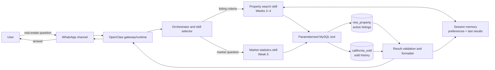
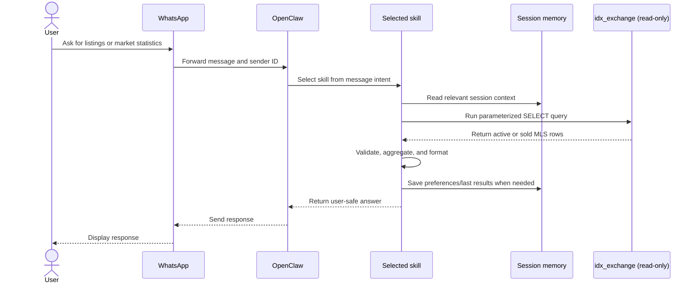

# IDX AI Agent Architecture

## Goal and scope

This system answers California real-estate questions received through WhatsApp. OpenClaw selects the appropriate skill, reads MLS-derived data from a read-only MySQL account, updates only short-lived conversation state, and returns a concise answer to the same user.

The current workspace contains the property-search flow (Weeks 2–4) and market-statistics flow (Week 5). The WhatsApp channel is the transport boundary; its connection health is operationally separate from the application code.

## End-to-end workflow





## Component responsibilities

| Component | Responsibility | Current implementation |
| --- | --- | --- |
| WhatsApp channel | Authenticates the channel and transports inbound/outbound messages | OpenClaw channel; connection health must be checked separately |
| OpenClaw runtime | Owns the workspace, routes messages, loads skills, and invokes tools | Workspace points to `/Users/peggy/Desktop/IDX_AI` |
| Skill selector | Chooses property search or market statistics from user intent | OpenClaw skill discovery plus skill descriptions |
| Property search | Parses preferences, searches active inventory, and supports follow-up turns | Week 2, Week 3, and Week 4 folders |
| Market statistics | Calculates city-level median/average price, DOM, list-to-close ratio, inventory, MoM, and YoY | Week 5 and `skills/market-statistics/` |
| Session memory | Keeps per-user filters and recent results; reset clears the session | Week 4 `session.ts` |
| MySQL tool | Executes parameterized, read-only queries | Week 3 `mysql.ts` |
| MLS-derived data | Separates live inventory from sold history | `rets_property`, `california_sold` in `idx_exchange` |

## Routing rules

- Listing requests such as “three-bedroom condo in Irvine under $1M” route to property search.
- Follow-up messages reuse the session’s city, budget, property type, and bedroom preferences.
- Questions such as “How is the Irvine market?” or “What is the median price in Pasadena?” route to market statistics.
- Ambiguous requests should trigger one short clarifying question instead of guessing a city.
- A user reset clears conversation state, not MLS data.

## Data and security boundaries

- The application connects as `idx_ai_agent`, which has `SELECT` access only to `idx_exchange.*`.
- The MySQL password is read from macOS Keychain service `IDX_AI_MYSQL`; it is not stored in source control or printed in logs.
- User values are passed as SQL parameters. They are never concatenated into SQL.
- Listing pagination is capped at 50 rows per request. Market summaries return aggregates rather than raw bulk exports.
- Sold-data queries exclude dates after `CURDATE()` because the supplied dataset contains a few future-dated records.
- Session memory must not contain database credentials or unrelated WhatsApp messages.

## Failure handling

| Failure | User-visible behavior | Operational action |
| --- | --- | --- |
| WhatsApp disconnected | No message reaches the agent | Re-authenticate/restart the OpenClaw channel |
| Missing city | Ask which California city to analyze | Do not query yet |
| No matching rows | Explain that no matching data was found | Suggest a wider period or corrected city |
| MySQL unavailable | Return a temporary-service message without secrets | Check MySQL and Keychain access |
| Invalid/oversized input | Return a specific validation message | Keep existing session state intact |
| Skill/tool exception | Log the error category, not credentials or raw user history | Fail closed; do not invent statistics |

## Verification and runbook

From the workspace root:

```bash
npm run week1
npm run week2
npm run week3
npm run week4
npm run week5
```

Acceptance criteria:

1. The architecture shows the full path from WhatsApp through OpenClaw skills to both MLS-derived tables and back.
2. The property-search tests validate parsing, live queries, multi-turn memory, and reset behavior.
3. The market-statistics test validates median price, DOM, list-to-close ratio, active-versus-sold inventory, and a 12-month MoM/YoY trend against the real database.
4. No credential is committed or displayed.

## Implementation status

- Complete: Weeks 1–5 workspace artifacts, database access, automated tests, and the market-statistics workspace skill.
- External dependency: WhatsApp must be connected and the OpenClaw gateway must be running for an end-to-end channel test.
